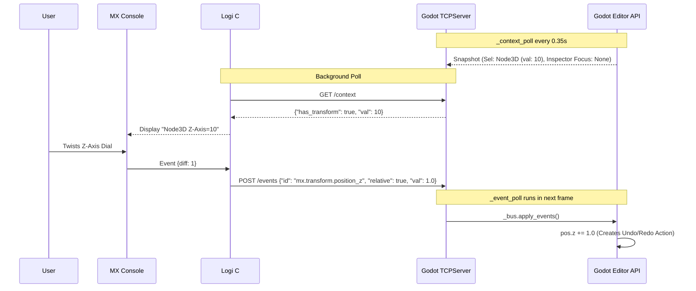

# Technical Architecture

This Godot Addon enables a seamless 2-way architecture connecting the Godot Engine context to Logitech's Loupedeck Service.

## 🧱 Components

There are two completely disconnected components that must talk to each other:

1. **Logitech MX C# Plugin:** Installed globally on the OS, running under `LogiPluginService`.
2. **Godot GDScript Addon:** Installed strictly locally per-project in your `res://addons` folder, running inside the Godot Editor thread.

## 🌉 The Local HTTP Bridge

Because Logitech's service is an external binary, it cannot access Godot Engine memory directly via standard language bindings. 

To solve this, the **Godot Addon** spins up a local Rest HTTP Server (via `mx_bridge_service.gd` leveraging Godot's `TCPServer`). 

- **Port Discovery:** Godot creates a handshake token in a `.mx_creative_console.token` file inside the `.godot/` folder. The C# Plugin scans the user's project structure, discovers the handshake, and routes traffic directly to Godot's dynamically assigned UDP/TCP port.

## 📥 Data Flow

The system operates asynchronously to ensure absolute zero lag on Editor operations.

### Godot to Logitech (Context Polls):

1. The Addon initiates a `context_poll` (every 0.35 seconds).
2. It aggregates data using **Option Providers** (`tile_map_provider`, `node_transform_provider`, etc.) by asking them to build tiny "Snapshots" of Godot's current editor state.
3. These Snapshots are transformed into generic `options` and serialized.
4. Logitech continuously queries `GET /context` using the HTTP Bridge, reads these states, and visibly changes the MX Creative Console layout/labels.

### Logitech to Godot (Physical Dial Events):

1. User twists a dial quickly.
2. Logitech's C# Plugin accumulates the "velocity diff" and creates an `Event` JSON.
3. Logitech sends `POST /events` into Godot extremely fast (avg < 2ms latency).
4. Godot queues the event. Godot's main thread `_event_poll` checks the queue and executes the exact equivalent Editor API modification on the active Node.
  - *All hardware actions are executed natively as Delta instructions (e.g., `relative: true`), avoiding stale state echoing and rubber-banding during high-speed physics calculation.*

## 🔌 Architecture Diagram

